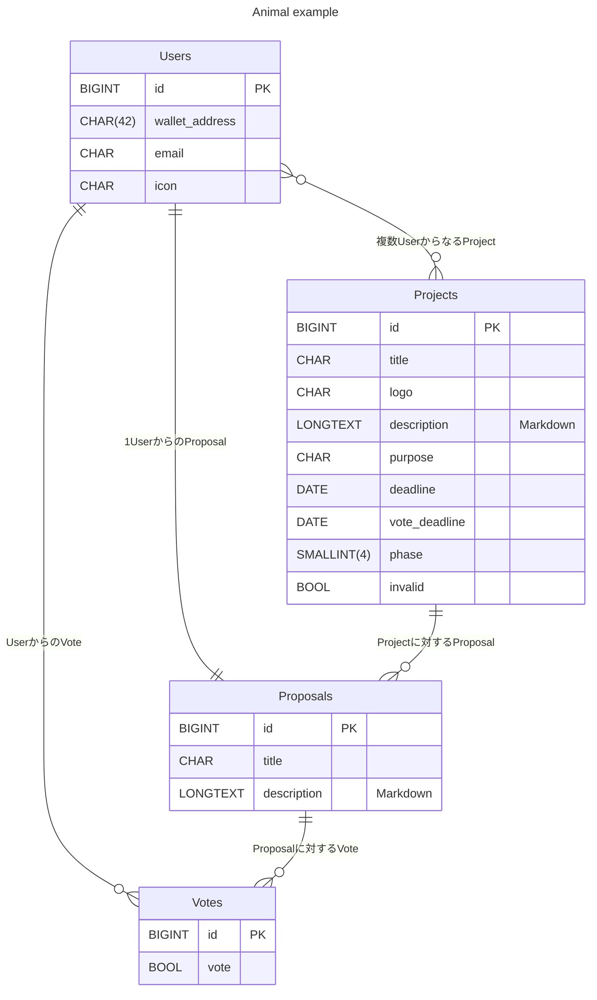

# Entity Relationship Diagram

## Reference

- https://mermaid.js.org/
- https://mermaid.live/
- [【MySQL】データ型一覧](https://ysklog.net/mysql/1797.html)
- [【Mermaid】ER図の作成方法](https://qiita.com/P-man_Brown/items/33834fe6dd4833dc1809)
- [MermaidでER図を書いてみました](https://zenn.dev/aldagram_tech/articles/a10166f763d30e)
